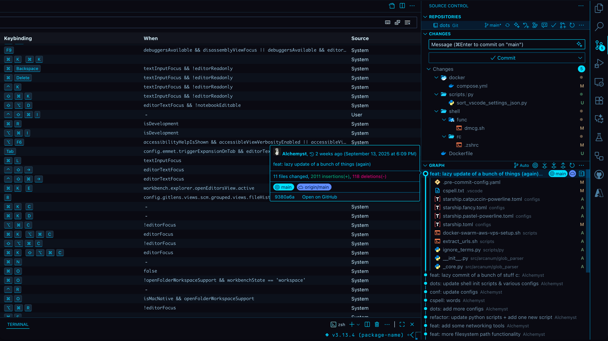
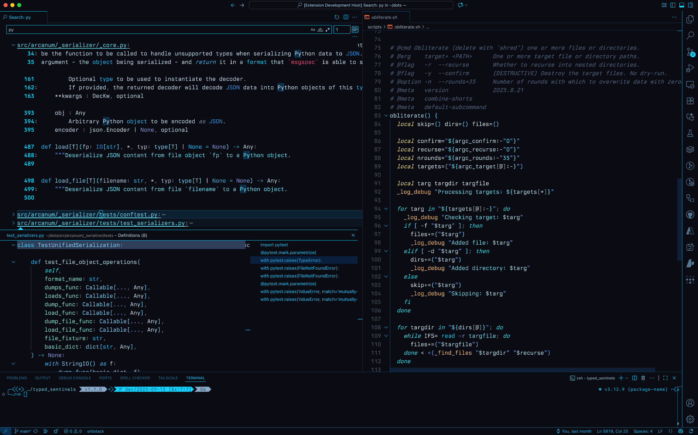
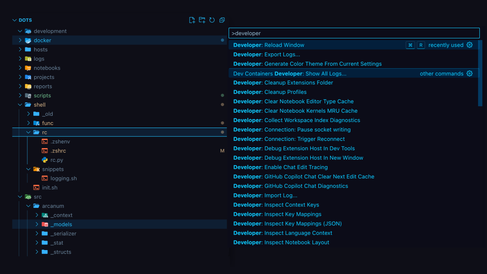

## Blockmage VS Code Color Theme

A dark (near-black) color theme with electric blue/cyan accents, by [`Blockmage.dev`](https://blockmage.dev).

---

### Note for Modern UI Users

If you are using the new VS Code "Modern UI" layout, please ensure the following setting is enabled in your
`settings.json` to maintain proper tab contrast and definition:

```json
"workbench.experimental.modernUIEditorTabStyle": "pill"
```

Without this setting, editor tabs may appear flat or lack visual separation in the current VS Code implementation.

## Screenshots

### Keyboard Settings and Source Control



### Split Editor View



### File Explorer



## License

[Apache-2.0](./LICENSE)
